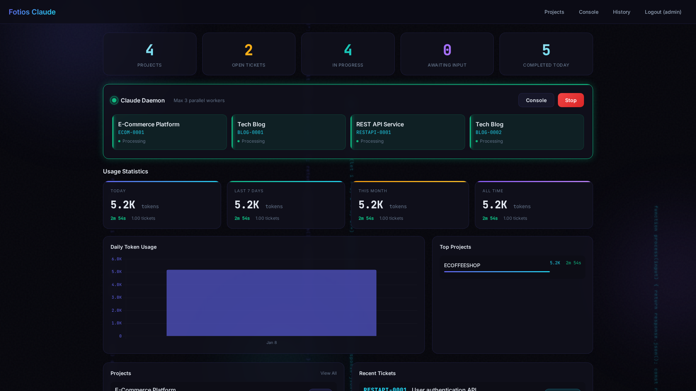
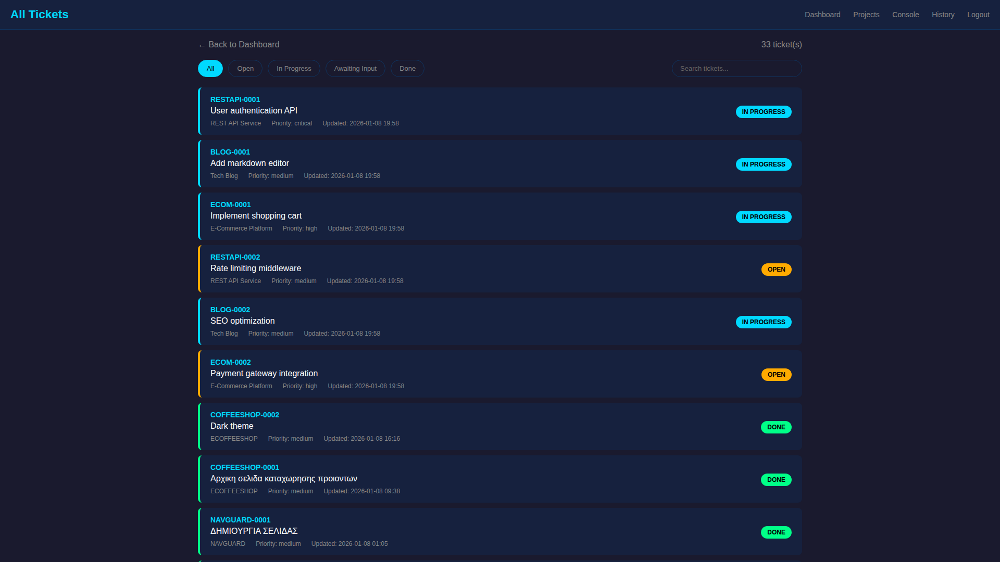

<p align="center">
  
</p>

<h1 align="center">CodeHero</h1>

<p align="center">
  <strong>The Developer That Never Rests</strong><br>
  <em>Powered by Claude AI</em>
</p>

<p align="center">
  <a href="LICENSE"></a>
  <a href="CHANGELOG.md"></a>
  
  <a href="https://anthropic.com"></a>
  <a href="https://github.com/fotsakir/codehero/stargazers"></a>
</p>

> **This is not an AI that answers questions. It builds software.**

Instead of chatting back and forth, this AI works inside a real development environment. Describe what you want, and it plans the project, writes code, and tracks its own progress — like a developer on your team.

What makes it different is **control**. It understands your whole project, uses only the files it needs, avoids loops, and stops itself when something goes wrong.

For beginners, it removes complexity.
For developers, it removes noise.

**Download it. Let it build.**

### True Autonomy - Works While You Sleep

Unlike chat-based AI tools that require constant prompting, this system runs **unattended for hours or even days**. Create your tickets, describe what you want, and walk away. Come back to find completed features, fixed bugs, and working code.

- Queue multiple tasks across projects
- AI works through them one by one
- Built-in failsafe prevents runaway sessions
- Wake up to progress, not prompts

### Control Everything from Your Phone

Work from anywhere with **two-way Telegram integration**. No need to open a laptop.

- **Get instant alerts** when Claude needs your input or something fails
- **Reply to continue** - just reply to any notification to give Claude new instructions
- **Ask quick questions** - start with `?` to get status updates without triggering work
- **Never lose time** - respond from the bus, the coffee shop, or your bed

```
📱 Notification: "Task completed - awaiting review"
     ↓
💬 You reply: "add error handling too"
     ↓
🤖 Claude continues working
```

---

## Screenshots


*Dashboard - Real-time overview of projects, tickets, and usage statistics*


*Tickets - Track all development tasks across projects*


*Projects - Manage multiple projects with isolated environments*


*Ticket Detail - Claude's response with code and conversation history*


*Console - Real-time view of Claude working on tickets*

---

## Why CodeHero?

| Challenge | Solution |
|-----------|----------|
| "AI tools need constant prompting" | **Set it and forget it** - Claude works for hours unattended |
| "I want to code more, but time is limited" | **Multiply your output** - wake up to completed features |
| "Chat-based AI feels like extra work" | **True autonomy** - describe once, Claude figures out the rest |
| "I need my code to stay private" | **Self-hosted** - your code never leaves your infrastructure |
| "I want to think bigger, not type more" | **Master from above** - architect solutions, let AI build them |

## Key Features

### Intelligent AI Features

#### SmartContext - Intelligent Context Management
Claude automatically understands your project structure without being told:
- **Auto-detects** framework, language, and architecture
- **Finds relevant files** based on the task at hand
- **Builds minimal context** - only includes what's needed
- **Learns patterns** from your codebase conventions
- **Reduces token usage** by up to 70% vs. sending entire codebase

#### AI Failsafe (Watchdog)
Built-in protection against runaway AI sessions:
- **Monitors all active tickets** every 30 minutes
- **Detects stuck patterns**: repeated errors, circular behavior, no progress
- **Auto-pauses problematic tickets** before excessive token usage
- **Telegram notifications** when issues detected
- **Explains why** it stopped in the conversation

#### AI Project Manager (Blueprint Planner)
Let Claude design and build your entire project from a single description:

**How it works:**
1. Describe what you want to build
2. CodeHero Manager creates the plan (tech stack, features, database)
3. Creates the project and tickets automatically
4. You just wait - wake up to working code

- **"Plan with AI"** button on Projects page
- **Guided questionnaire** - Claude asks about requirements
- **Auto-creates project** with correct paths and settings
- **Auto-creates tickets** with dependencies and sequences
- **Choose execution mode** - autonomous, semi-autonomous, or supervised

#### Claude Assistant
Interactive Claude terminal with full control:
- **AI Model Selection**: Choose Opus, Sonnet, or Haiku per session
- **Popup Window**: Open in separate window for multi-monitor setups
- **Direct Access**: Chat with Claude outside of ticket workflow
- **Full Terminal**: Real PTY with color support

#### Execution Modes
Control how Claude runs your tickets with three security levels:

| Mode | Description | Best For |
|------|-------------|----------|
| **Autonomous** | Full access, no permission prompts | Trusted tasks, experienced users |
| **Semi-Autonomous** | Smart sandbox with automatic rules (recommended) | Most projects |
| **Supervised** | Asks permission for all write operations | Sensitive projects, learning |

**Semi-Autonomous Mode** (New!) - The smart middle ground:
- ✅ **Auto-allows**: File operations within project, running tests, builds, linting
- ⚠️ **Asks permission**: Package installs (`npm install`, `pip install`), git commits, database migrations
- 🚫 **Blocks**: System files, `/etc`, `.git` folder modifications, dangerous commands
- 🔄 **"Approve Similar"**: Approve once, auto-approve similar operations

Set per-ticket or project-wide - override defaults as needed

#### Dependency Modes
Control how tickets progress and close:
- **Strict** (default) - User reviews and closes tickets manually
- **Relaxed** - AI reviewer automatically closes completed tickets
- **Useful for chained tasks** - Keep work flowing without manual intervention

| Mode | Ticket Closing | Best For |
|------|---------------|----------|
| Strict | User closes manually | Critical tasks, review needed |
| Relaxed | AI auto-closes | Batch work, trusted workflows |

#### Visual Verification - "See With Your Eyes"
Claude can see exactly what you see:
- **Screenshot capture** - Claude takes screenshots using Playwright
- **Visual analysis** - Describes layout, styling, and UI issues
- **No more explaining** - Just click "👁️ See" and Claude sees the problem
- **Automatic when needed** - Mention visual issues and Claude uses Playwright automatically

#### Monaco Editor with LSP Support
VS Code-quality code editing right in your browser:
- **Monaco Editor** - The same editor that powers VS Code
- **Intelligent Autocomplete** - Context-aware suggestions as you type
- **Hover Documentation** - See function docs by hovering
- **Go to Definition** - Ctrl+Click to jump to definitions
- **Real-time Diagnostics** - Errors and warnings as you type
- **Multi-language Support** - Python, JavaScript, TypeScript, PHP, Java, C#, Kotlin, HTML, CSS, JSON
- **Optional LSP Servers** - Install only what you need with `setup_lsp.sh`

#### Git Version Control
Automatic version control for every project:
- **Auto-commit** - When AI completes work, changes are committed automatically
- **Commit Messages** - Format: `[TICKET-NUM] Title` with full metadata
- **Git History Page** - View all commits with timeline and diff viewer
- **Rollback** - Restore any previous version with one click (preserves history)
- **Smart .gitignore** - Auto-generated based on project type (PHP, Python, Node, .NET)
- **AI Context** - Claude sees recent commits and can self-correct based on history
- **Initialize Existing** - Add Git to existing projects from the web UI

#### Telegram - Work from Your Phone
Full two-way communication via Telegram. Control your AI developer from anywhere:
- **Instant Notifications** - Get alerts when tasks complete, fail, or get stuck
- **Reply to Execute** - Reply to any notification and Claude starts working
- **Quick Questions** - Add `?` to get instant status updates via AI
- **Never Wait** - Respond immediately from your phone, no laptop needed
- **Easy Setup** - One-click configuration from Settings panel (⚙️)

### Core AI Features
- **Autonomous AI Agent** - Claude AI works on tickets independently, writing real code
- **Multi-Project Management** - Handle multiple projects with isolated databases
- **Parallel Execution** - Process tickets from different projects simultaneously
- **Real-Time Console** - Watch Claude write code live in your browser
- **Interactive Chat** - Guide Claude or ask questions during execution
- **Voice Input** - Speak instead of typing in ticket chat (auto-stops after 10s silence)

### Ticket Management
- **Ticket Workflow** - Structured flow: Open → In Progress → Awaiting Input → Done
- **Kill Switch** - Instant control while Claude is working:
  - `/stop` command or Stop button - Pause immediately and wait for correction
- **Message Queue** - Messages sent during execution are read when Claude finishes
- **Auto-Close** - Tickets auto-close after 7 days in awaiting input
- **Search** - Search across tickets, projects, and history

### Web Terminal
Full Linux terminal in your browser:
- **Real shell access** via WebSocket
- **Popup support** for multi-monitor setups
- **Full sudo access** for system administration
- **256-color support** with xterm.js

### Backup & Restore
- **Auto Backup on Close** - Project automatically backed up when ticket completes
- **Manual Backup** - Create backup anytime from project page
- **Restore** - Restore project files to any previous backup point
- **Export Project** - Download complete project as ZIP

### Project Migration
Move projects between servers with all data intact:
- **Export for Migration** - Full backup with tickets, conversations, and database
- **Export Full** - Complete backup including conversation history
- **Export Light** - Smaller backup without conversations
- **Import Migration** - Restore on any CodeHero server
- **Simple Import** - Import files + database only (no tickets)

### File Management
- **File Upload** - Upload files directly to project via web interface
- **File Editor** - Edit project files in browser with syntax highlighting
- **File Browser** - Navigate project directory structure

### Project Features
- **Auto Database Provisioning** - MySQL database auto-created per project
- **phpMyAdmin Integration** - Full database management with auto-login (port 9454)
- **Voice Input** - Speak to create projects and tickets (name, description fields)
- **Project Archive/Reopen** - Archive completed projects, reopen when needed
- **Global Context** - Server environment info shared with all projects
- **Tech Stack Detection** - Knows installed tools (Node.js, PHP, Java, etc.)

### Monitoring & Analytics
- **Real-Time Usage Tracking** - Tokens, API requests, and work duration tracked in real-time
- **Per-Project Stats** - See exactly how much each project costs
- **Per-Ticket Stats** - Know the cost of every feature or fix
- **Time-Based Reports** - Daily, weekly, and monthly usage summaries
- **Session History** - View all Claude sessions with full output
- **Daemon Status** - Monitor background worker status

### Infrastructure
- **Web Dashboard** - Beautiful dark-theme admin panel
- **SSL Encryption** - All traffic encrypted via Nginx
- **Self-Hosted** - Complete control over your data
- **CLI Tool** - Manage projects and tickets from terminal

## Supported Application Types

CodeHero supports multiple project types with intelligent context and tooling:

### Web Development
- **PHP / WordPress** - Full PHP-FPM integration with Nginx
- **Static HTML/CSS/JS** - Served directly via Nginx
- **API Projects** - REST and GraphQL endpoints

### .NET / ASP.NET Core
- **Full .NET 8 SDK** support with automatic configuration
- **Auto Nginx Proxy** - Each .NET app gets its own reverse proxy route
- **Systemd Services** - Apps run as managed services with auto-restart
- **Port Management** - Automatic port allocation (5001+)
- **PowerShell, Mono, Wine** - Windows development tools available

### Mobile Development (Android)

#### Android Emulator with Web Visualization
Run and test Android apps directly from your browser:
- **Server-based Emulator** - Redroid (Android in Docker)
- **Live Screen Mirror** - See and control the emulator via ws-scrcpy
- **ADB Integration** - Install APKs, view logs, capture screenshots
- **Framework Support** - Capacitor.js, React Native, Flutter, Native Android

```
📱 Your Browser → ws-scrcpy (HTTPS:8443) → Redroid Container
                         ↓
                   Live Android Screen
                   Touch/Keyboard Input
```

#### Remote ADB Device
Connect to physical Android devices or remote emulators:
- **Remote ADB** - Connect to any device via IP:PORT
- **Same Commands** - Install, debug, and test seamlessly
- **No Local Setup** - Everything runs on the server

### Backend / API
- **Node.js** - Full Node 22.x with npm
- **Python** - Python 3 with Flask, Django support
- **Java** - GraalVM 24 with Gradle

### Optional Setup Scripts
After initial installation, run these scripts based on your needs:

| Script | What it installs |
|--------|------------------|
| `setup_android.sh` | Docker, Redroid emulator, ws-scrcpy, ADB, Flutter, Gradle |
| `setup_windows.sh` | .NET 8 SDK, PowerShell, Wine, Mono, NuGet |
| `setup_devtools.sh` | Node.js, Java (GraalVM), multimedia tools (ffmpeg, ImageMagick, tesseract) |
| `setup_lsp.sh` | Language servers for code editor (Python, JS/TS, PHP, Java, C#, Kotlin, HTML/CSS) |

```bash
# Android development (emulator + mobile frameworks)
sudo /opt/codehero/scripts/setup_android.sh

# Windows/.NET development
sudo /opt/codehero/scripts/setup_windows.sh

# Development tools (Node.js, Java, multimedia)
sudo /opt/codehero/scripts/setup_devtools.sh

# Code editor LSP (optional - for autocomplete, hover docs, etc.)
sudo /opt/codehero/scripts/setup_lsp.sh
```

---

## Perfect For

- **Solo Developers** - Multiply your productivity with an AI coding partner
- **Small Teams** - Offload routine development tasks to AI
- **Agencies** - Manage multiple client projects efficiently
- **Startups** - Ship faster with AI-assisted development
- **Learning** - See how AI approaches coding problems
- **Mobile Developers** - Test Android apps without local emulator setup

## Quick Start

### One-Click Install (Recommended)

**No technical knowledge required!** Works on Windows, macOS, and Linux.

**🪟 Windows** - Open PowerShell as Admin, paste:
```powershell
irm https://raw.githubusercontent.com/fotsakir/codehero/main/multipass/install-windows.ps1 | iex
```

**🍎 macOS** - Open Terminal, paste:
```bash
curl -sL https://raw.githubusercontent.com/fotsakir/codehero/main/multipass/install-macos.command | bash
```

**🐧 Linux** - Open Terminal, paste:
```bash
curl -sL https://raw.githubusercontent.com/fotsakir/codehero/main/multipass/install-linux.sh | bash
```

Paste → Enter → Wait 15 minutes → Done! [Full guide →](docs/MULTIPASS_INSTALL.md)

**After installation:**
- Dashboard: `https://VM_IP:9453` (login: admin / admin123)
- Change passwords: `sudo /opt/codehero/scripts/change-passwords.sh`

---

### Manual Install (Ubuntu Server)

#### Requirements

- Ubuntu 22.04 or 24.04 LTS (server or desktop)
- 2GB+ RAM recommended
- Root/sudo access
- Internet connection

#### One-Command Install

```bash
# Install required tools
apt-get update && apt-get install -y unzip wget net-tools

# Download and extract
cd /root
wget https://github.com/fotsakir/codehero/releases/latest/download/codehero-2.80.2.zip
unzip codehero-2.80.2.zip
cd codehero

# Run setup
chmod +x setup.sh && ./setup.sh

# Find your IP address
ifconfig

# Then install Claude Code CLI
/opt/codehero/scripts/install-claude-code.sh
```

The installer automatically sets up:
- MySQL 8.0 database
- Nginx web server with SSL and PHP-FPM
- Python Flask application
- Claude Code CLI
- Background daemon service
- All required dependencies

### Upgrading from Previous Version

```bash
# Download new version
cd /root
unzip codehero-2.80.2.zip
cd codehero

# Preview changes (recommended)
sudo ./upgrade.sh --dry-run

# Run upgrade
sudo ./upgrade.sh

# Or auto-confirm all prompts
sudo ./upgrade.sh -y
```

The upgrade script will:
- Create automatic backup of current installation
- Apply any database migrations
- Update all application files
- Restart services
- Show what changed in the new version

### Access Your Dashboard

| Service | URL | Default Login |
|---------|-----|---------------|
| **Admin Panel** | `https://YOUR_IP:9453` | admin / admin123 |
| Web Projects | `https://YOUR_IP:9867` | - |
| phpMyAdmin | `https://YOUR_IP:9454` | auto-login from project |

---

## Claude Activation

CodeHero requires Claude to be activated before it can work on tickets. You have **two activation methods** and can use either the **Web Terminal** or **Linux Terminal**.

### Method 1: Claude Subscription (Pro/Max)

If you have a Claude Pro or Claude Max subscription at [claude.ai](https://claude.ai), you can use it directly.

#### Via Web Terminal (Dashboard)

1. Go to **Dashboard** → Click **"Activate Claude"** button (or "License Active")
2. Click **"Open Terminal"** in the Subscription section
3. In the terminal, type:
   ```bash
   claude
   ```
4. Once Claude starts, type:
   ```
   /login
   ```
5. Claude will display a URL - **copy it** (right-click → Copy)
6. Open the URL in your browser and authorize access
7. Copy the authorization code from the browser
8. Paste it back in the terminal (right-click → Paste)
9. Done! Claude is now activated with your subscription

#### Via Linux Terminal (SSH)

1. SSH into your server or open a terminal
2. Switch to the claude user:
   ```bash
   sudo su - claude
   ```
3. Run Claude and login:
   ```bash
   claude
   ```
4. Type `/login` and follow the same authorization flow as above

### Method 2: Anthropic API Key

If you have an API key from [console.anthropic.com](https://console.anthropic.com), you can use it instead of a subscription.

#### Via Dashboard

1. Go to **Dashboard** → Click **"Activate Claude"** button
2. Select the **"API Key"** section
3. Paste your API key (starts with `sk-ant-api...`)
4. Click **Save**

#### Via Linux Terminal

1. SSH into your server
2. Create or edit the environment file:
   ```bash
   sudo mkdir -p /home/claude/.claude
   sudo nano /home/claude/.claude/.env
   ```
3. Add your API key:
   ```
   ANTHROPIC_API_KEY=sk-ant-api03-your-key-here
   ```
4. Save and set permissions:
   ```bash
   sudo chown claude:claude /home/claude/.claude/.env
   sudo chmod 600 /home/claude/.claude/.env
   ```

### Verify Activation

After activation, the **"Activate Claude"** button in the dashboard will change to **"License Active"** (green).

You can also verify from terminal:
```bash
sudo su - claude
claude --version
```

### Deactivate License

To deactivate (e.g., to switch methods):
1. Dashboard → Click **"License Active"** → **"Deactivate License"**

Or via terminal:
```bash
rm /home/claude/.claude/.credentials.json
rm /home/claude/.claude/.env
```

---

## How It Works

```
┌─────────────┐     ┌─────────────┐     ┌─────────────┐     ┌─────────────┐
│   Create    │     │   Daemon    │     │  Claude AI  │     │    Code     │
│   Ticket    │ ──► │   Picks Up  │ ──► │   Works     │ ──► │  Delivered  │
│             │     │   Ticket    │     │   On Task   │     │             │
└─────────────┘     └─────────────┘     └─────────────┘     └─────────────┘
       │                                       │
       │            ┌─────────────┐            │
       └───────────►│  You Watch  │◄───────────┘
                    │  Real-Time  │
                    └─────────────┘
```

1. **Create a ticket** - Describe what you need built
2. **Daemon assigns it** - Background service picks up open tickets
3. **Claude works** - AI writes code, creates files, runs commands
4. **You review** - Watch in real-time or review when complete
5. **Iterate** - Send messages to refine, or close when satisfied

## Ticket Workflow

```
┌──────┐     ┌─────────────┐     ┌─────────────────┐     ┌──────┐
│ open │ ──► │ in_progress │ ──► │ awaiting_input  │ ──► │ done │
└──────┘     └─────────────┘     └────────┬────────┘     └──────┘
                                          │
                              Send Message │ (refine/continue)
                                          ▼
                                    ┌──────────┐
                                    │   open   │
                                    └──────────┘
```

Tickets auto-close after 7 days in `awaiting_input` if no action taken.

## Architecture

```
                    ┌────────────────────────────────┐
                    │           INTERNET             │
                    └───────┬───────────┬────────────┘
                            │           │
                       Port 9453   Port 9867
                      Admin Panel  Web Projects
                            │           │
                    ┌───────┴───────────┴────────┐
                    │          Nginx             │
                    │    (SSL Termination)       │
                    └───────┬───────────┬────────┘
                            │           │
                    ┌───────┴───┐ ┌─────┴───────┐
                    │   Flask   │ │  PHP-FPM    │
                    │  Web App  │ │  Projects   │
                    └───────┬───┘ └─────────────┘
                            │
                    ┌───────┴───────┐
                    │    Daemon     │──── Claude Code CLI
                    │  (Background) │
                    └───────┬───────┘
                            │
                    ┌───────┴───────┐
                    │    MySQL      │
                    │   Database    │
                    └───────────────┘
```

## CLI Commands

```bash
# Create a project
claude-cli project add --name "My E-Commerce" --code SHOP

# Create a ticket
claude-cli ticket add --project SHOP --title "Build user authentication" --priority high

# Check system status
claude-cli status

# Control daemon
claude-cli daemon start|stop|status
```

## Configuration

Edit `/etc/codehero/system.conf`:

```bash
# Database connection
DB_HOST=localhost
DB_NAME=claude_knowledge
DB_USER=claude_user
DB_PASSWORD=your-secure-password

# Parallel processing (how many tickets at once)
MAX_PARALLEL_PROJECTS=3

# Auto-close tickets after N days
REVIEW_DEADLINE_DAYS=7
```

## Tech Stack

- **Backend**: Python 3, Flask, Flask-SocketIO
- **Database**: MySQL 8.0
- **Web Server**: Nginx with PHP-FPM
- **AI**: Claude AI via Claude Code CLI
- **OS**: Ubuntu 22.04 / 24.04 LTS

## Documentation

| Document | Description |
|----------|-------------|
| [One-Click Install](docs/MULTIPASS_INSTALL.md) | Easiest install for Windows, macOS, Linux |
| [User Guide](docs/USER_GUIDE.md) | How to use the admin panel (with screenshots) |
| [Migration Guide](docs/MIGRATION.md) | Move projects between servers |
| [Domain & SSL Setup](docs/DOMAIN_SETUP.md) | Configure domains with Let's Encrypt SSL |
| [2FA Setup](docs/2FA_SETUP.md) | Enable Two-Factor Authentication with Google Authenticator |
| [WAF Setup](docs/WAF_SETUP.md) | ModSecurity Web Application Firewall with OWASP rules |
| [LSP Setup](docs/LSP_SETUP.md) | Install language servers for code editor features |
| [Telegram Setup](docs/TELEGRAM_SETUP.md) | Get instant alerts on your phone |
| [VM Installation](docs/VM_INSTALLATION.md) | Install on VMware, Hyper-V, VirtualBox, UTM, Parallels |
| [Installed Packages](docs/INSTALLED_PACKAGES.md) | All tools & packages (ffmpeg, ImageMagick, OCR, etc.) |
| [INSTALL.md](INSTALL.md) | Detailed installation guide |
| [CLAUDE_OPERATIONS.md](CLAUDE_OPERATIONS.md) | System management & troubleshooting |
| [CHANGELOG.md](CHANGELOG.md) | Version history |
| [CLAUDE.md](CLAUDE.md) | Development workflow for contributors |

## Important Notice

> **Warning**: This system runs Claude AI with **unrestricted access** to your server. Claude can execute commands, create/modify/delete files, access databases, and perform any operation the system user can do.
>
> **Use at your own risk.** The authors and contributors are not responsible for any damage, data loss, security issues, or other consequences resulting from the use of this software. Always run on isolated/dedicated servers and maintain proper backups.

## Security

- **Self-hosted**: Your code stays on your server
- **SSL encryption**: All web traffic encrypted
- **Isolated databases**: Each project gets its own MySQL database
- **Configurable access**: Restrict admin panel to trusted IPs

### Two-Factor Authentication (2FA)

Optional TOTP-based 2FA for enhanced login security:

- **Google Authenticator Support** - Works with any TOTP app (Authy, Microsoft Authenticator, etc.)
- **Account Lockout** - Automatic 30-minute lockout after 5 failed login attempts
- **Remember Device** - Skip 2FA on trusted devices until end of month
- **Terminal Management** - Enable/disable 2FA from command line

```bash
# Manage 2FA settings
sudo /opt/codehero/scripts/manage-2fa.sh

# Direct commands
sudo /opt/codehero/scripts/manage-2fa.sh enable    # Enable 2FA
sudo /opt/codehero/scripts/manage-2fa.sh disable   # Disable 2FA
sudo /opt/codehero/scripts/manage-2fa.sh unlock    # Unlock after failed attempts
sudo /opt/codehero/scripts/manage-2fa.sh status    # Check current status
```

See [2FA Setup Guide](docs/2FA_SETUP.md) for detailed instructions.

### Change Passwords

After installation, change default passwords:
```bash
sudo /opt/codehero/scripts/change-passwords.sh
```

## Contributing

Contributions are welcome!

1. Fork the repository
2. Create your feature branch (`git checkout -b feature/amazing-feature`)
3. Commit your changes (`git commit -m 'Add amazing feature'`)
4. Push to the branch (`git push origin feature/amazing-feature`)
5. Open a Pull Request

See [CLAUDE.md](CLAUDE.md) for development guidelines.

## Support

- **Issues**: [GitHub Issues](../../issues)
- **Discussions**: [GitHub Discussions](../../discussions)

## License

This project uses a **Dual License** - free for personal use and small businesses, commercial license required for larger organizations. See [LICENSE](LICENSE) for details.

---

<p align="center">
  <b>Built with Claude AI</b><br>
  <sub>If you find this useful, please star the repository!</sub>
</p>

## Author

**Fotios Tsakiridis** ([@fotsakir](https://github.com/fotsakir))

[Smartnav Telematic Services Cyprus Ltd](https://routeplanner.gr)

## Keywords

`claude-ai` `anthropic` `ai-coding-assistant` `autonomous-agent` `code-generation` `ai-developer` `self-hosted` `ticket-system` `project-management` `flask` `mysql` `nginx` `ubuntu` `devops` `automation` `open-source` `php` `python` `human-ai-collaboration` `future-of-programming` `proof-of-concept` `ai-pair-programming` `agentic-ai`
